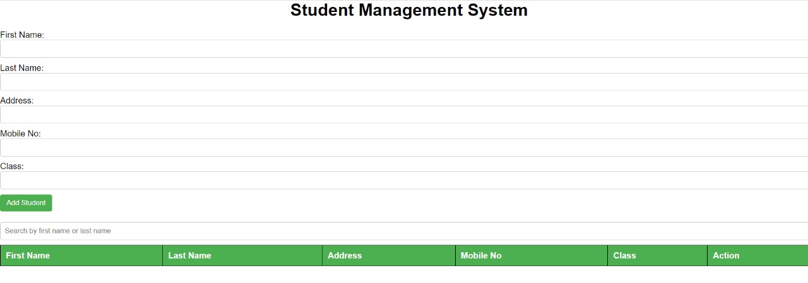
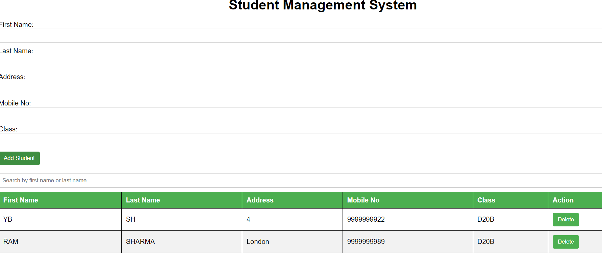

# 🎓 Student Management System

A simple and intuitive **Student Management System** built to help educational institutions efficiently manage student records. This web application allows users to view, add, edit, and delete student information with ease, making the administration process seamless. 

🚀 **Deployed App:** [Click here to explore the live version](https://manavjawrani.github.io/Studentmanagement/)

---

## ✨ Features

- 📋 **View Students**: Easily see all registered students in a clean table layout.
- ➕ **Add Students**: Quickly add new student details to the system.
- 📝 **Edit Student Information**: Update existing student records with a user-friendly form.
- 🗑️ **Delete Students**: Remove students from the system.
- 📱 **Responsive Design**: Optimized for use on all devices, including mobile and tablets.

---

## 💻 Technologies Used

- 🌐 **HTML5**: Markup language used for structuring the pages.
- 🎨 **CSS3**: Styling for creating an attractive and responsive UI.
- ⚙️ **JavaScript**: Adds interactivity and handles dynamic functionality.
- 🌍 **GitHub Pages**: Deployed on GitHub Pages for easy access.

---

## 🛠️ Getting Started

Follow these steps to set up the project locally.

### Prerequisites

- A modern web browser (e.g., Chrome, Firefox, Safari)
- Basic knowledge of HTML, CSS, and JavaScript

### Installation

1. **Clone the repository**:
   ```bash
   git clone https://github.com/manavjawrani/Studentmanagement.git


2. **Navigate to the project directory**:
    cd Studentmanagement

 Screenshots
Here are some previews of the project in action:

🏠 Home Page


👨‍🎓 Student List


## 🏗️ Contributing

Contributions are welcome! If you have ideas to improve this project, follow the steps below to contribute:

1. **Fork this repository**.
2. **Create your feature branch**:
   ```bash
   git checkout -b feature/AmazingFeature

3. **Commit your changes**:
    git commit -m 'Add some amazing feature'

4.**Push to Branch**:
git push origin feature/AmazingFeature
